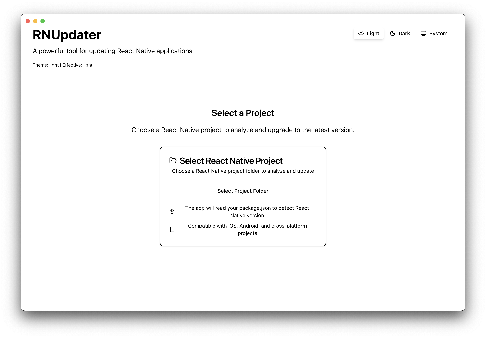

# RNUpdater

<div align="center">
  
  
  <h3>A powerful desktop application for automated React Native project updates and version management</h3>
  
  <p>Built with Electron and React, RNUpdater provides an intuitive interface for developers to safely upgrade their React Native projects with automated package updates and comprehensive diff analysis.</p>
  
  <div style="background-color: #f8f9fa; padding: 20px; border-radius: 8px; margin: 20px 0; border-left: 4px solid #007acc;">
    <h4>🎯 Why This Project is Important</h4>
    <p><strong>Streamlined React Native Updates:</strong> Updating React Native projects can be complex and error-prone, requiring manual package.json modifications, dependency updates, and configuration changes. RNUpdater automates this process by analyzing version diffs, providing selective package updates, and ensuring your project stays up-to-date with the latest React Native releases safely and efficiently.</p>
  </div>
  
  
  
  *Screenshot coming soon - showing the main interface with project selection, version list, and package update features*
  
  <br><br>
  
  
  
  
</div>

## ✨ Features

### 🔍 **Smart Project Analysis**

- **Automatic Detection**: Automatically detects React Native projects and analyzes their current configuration
- **Version Comparison**: Compare your current React Native version with available releases
- **Git Integration**: Display Git branch information and remote repository details
- **Package Analysis**: Comprehensive analysis of package.json dependencies and devDependencies

### 🚀 **Automated Package Updates**

- **Diff-Based Updates**: Analyze version diffs to identify required package updates
- **Selective Updates**: Choose which packages to update with an intuitive checkbox interface
- **Version Preservation**: Maintain existing version prefixes (^, ~, or exact versions)
- **Comprehensive Backup System**: Automatic backup of all files before applying changes
- **Safe Rollback**: Easy rollback functionality if updates cause issues

### 🔧 **Major Version Updates**

- **Complex Change Detection**: Automatically detect and categorize complex changes across file types
- **Multi-File Updates**: Handle package.json, native code, Gradle files, configuration files, and binary files
- **Binary File Management**: Download and replace JAR files, native libraries, and other binary assets
- **Native Code Updates**: Automated parsing and application of iOS/Android native code changes
- **Gradle Configuration**: Parse and apply Android Gradle configuration updates
- **Breaking Change Analysis**: Detect and warn about breaking changes during upgrades
- **Migration Scripts**: Generate step-by-step migration instructions for complex updates

### 🎯 **Version Management**

- **Release Fetching**: Fetch all available React Native releases from GitHub
- **Pagination Support**: Efficiently browse through hundreds of available versions
- **Load More**: Alternative infinite scroll-like interface for version browsing
- **Version Actions**: Quick actions for each version including upgrade and package updates

### 🖱️ **Intuitive Interface**

- **Project Selection**: Easy project folder selection with drag & drop support
- **Modern UI**: Clean, dark-themed interface built with Tailwind CSS
- **Responsive Design**: Optimized for different screen sizes
- **Real-time Updates**: Live updates as you make changes
- **Modal Management**: Enhanced modals with close buttons and keyboard shortcuts
- **Tabbed Interface**: Organized workflow with separate tabs for packages, complex changes, and migration

### 📋 **Project Information**

- **Comprehensive Details**: Display React Native version, React version, platform support
- **Bundle ID**: Show iOS/Android bundle identifier
- **Git Status**: Current branch and remote repository information
- **Package Dependencies**: Complete overview of all project dependencies

## 📋 Roadmap

### ✅ **Recently Completed**

- **📦 Package.json Updates**: Automated package.json updates based on version diffs
- **🔄 Major Version Updates**: Support for major React Native version upgrades with complex changes
- **📱 Binary File Parsing**: Parse and apply changes to iOS/Android binary files
- **🔧 Native Code Updates**: Automated parsing and application of native iOS/Android code changes
- **⚙️ Gradle Configuration**: Parse and apply Android Gradle configuration updates
- **💾 Comprehensive Backup System**: Automatic backup of all modified files
- **🎨 Enhanced UI**: Modal management with close buttons and keyboard shortcuts
- **📋 Tabbed Interface**: Organized workflow for complex updates

### 🚧 **In Progress**

- **📄 Podfile Updates**: Automated iOS Podfile dependency management
- **🔍 Advanced Diff Analysis**: More sophisticated diff parsing for complex project structures

### 🔮 **Future Features**

- **📊 Update History**: Track and manage update history with rollback capabilities
- **🎨 Theme Customization**: Light/dark theme options and customization
- **☁️ Cloud Sync**: Sync project configurations across devices
- **🔄 Batch Updates**: Update multiple projects simultaneously
- **📈 Update Analytics**: Track update success rates and common issues

## 🛠️ Technologies

- **🔋 Electron** - Cross-platform desktop framework
- **⚛️ React 19** - Modern UI library with hooks
- **💙 TypeScript 5** - Type-safe development
- **🎨 Tailwind CSS 4** - Utility-first styling
- **🍦 Lucide Icons** - Consistent iconography
- **📦 Zustand** - Lightweight state management
- **📡 GitHub API** - React Native releases fetching
- **🔧 Git Integration** - Git repository information

### 🔮 Upcoming Technologies

- **🔄 React Dropzone** - Drag and drop functionality

## 📦 Installation

### Prerequisites

- Node.js 20 or higher
- pnpm 10 or higher

### Development Setup

```bash
# Clone the repository
git clone https://github.com/imokhles/rn-updater.git
cd rn-updater

# Install dependencies
pnpm install

# Start development server
pnpm dev
```

### Building for Production

```bash
# Build for all platforms
pnpm build

# Build for specific platform
pnpm build --mac
pnpm build --win
pnpm build --linux
```

## 🚀 Usage

### Getting Started

1. **Launch RNUpdater**
2. **Select a React Native project** by:
   - Dragging and dropping the project folder onto the app
   - Clicking "Select Project Folder" and browsing to your project
3. **View project information** including current versions and Git details
4. **Browse available versions** using pagination or load more functionality
5. **Select a target version** and click "Upgrade Now"
6. **Choose package updates** from the diff analysis
7. **Apply changes** safely with automatic backup

### Supported Project Types

- React Native projects with package.json
- Projects with Git repositories
- iOS and Android platform support

> **⚠️ Compatibility Note**: Currently tested with React Native CLI projects. Expo support is planned for future releases.

### Keyboard Shortcuts

- **Cmd/Ctrl + O**: Open project folder
- **Escape**: Close modals and dialogs
- **Arrow Keys**: Navigate version list
- **Enter**: Select version or apply changes

## 📁 Project Structure

```
rn-updater/
├── src/
│   ├── main/                 # Electron main process
│   │   ├── services/        # Git and file system services
│   │   └── ipc/            # Inter-process communication
│   ├── renderer/            # React renderer process
│   │   ├── components/      # UI components
│   │   │   ├── package-updater/  # Package update components
│   │   │   └── version-selector/ # Version selection components
│   │   ├── lib/            # Utilities and services
│   │   └── screens/        # Main application screens
│   ├── shared/             # Shared types and constants
│   └── resources/          # Icons and assets
├── dist/                   # Built applications
└── docs/                   # Documentation
```

## 🔧 Development

### Available Scripts

```bash
pnpm dev          # Start development server
pnpm build        # Build for production
pnpm start        # Preview built app
pnpm lint         # Run linter
pnpm lint:fix     # Fix linting issues
```

### Architecture

- **MVVM Pattern**: Clean separation of concerns
- **Zustand Store**: Centralized state management
- **IPC Communication**: Secure main-renderer communication
- **TypeScript**: Full type safety throughout
- **Service Layer**: Modular services for different functionalities

## 🤝 Contributing

Contributions are welcome! Please feel free to submit a Pull Request. For major changes, please open an issue first to discuss what you would like to change.

### Development Guidelines

1. Follow the existing code style
2. Add tests for new features
3. Update documentation as needed
4. Ensure all checks pass

## 📄 License

This project is licensed under the MIT License - see the [LICENSE](LICENSE) file for details.

## 🙏 Acknowledgments

This project is built using the excellent [Electron App Boilerplate](https://github.com/daltonmenezes/electron-app) by [Dalton Menezes](https://github.com/daltonmenezes).

The boilerplate provides:

- 🔥 Fast and ready-to-go structure with React 19, TypeScript 5, and Tailwind CSS 4
- 🚀 Auto reload for main process and Fast Refresh for renderer
- 🎉 Window/Screen routing with Electron Router DOM
- 🔮 GitHub Action releases for Windows, Mac, and Linux
- 🔒 Source code protection support
- 🍪 Absolute paths support

Special thanks to Dalton for creating such a comprehensive and well-maintained boilerplate that makes Electron development a breeze! 🌟

### React Native Upgrade Helper

This project is inspired by and builds upon the excellent work of the [React Native Upgrade Helper](https://react-native-community.github.io/upgrade-helper) by the React Native community. RNUpdater uses the React Native Upgrade Helper's API to fetch version diffs and upgrade information, providing the foundation for all automated update capabilities.

RNUpdater extends this API integration by:

- Providing a desktop application for offline use
- Adding automated package.json updates
- Including Git workflow integration
- Offering selective update capabilities
- Supporting complex project analysis

We're grateful to the React Native community for their continuous efforts in making React Native upgrades more accessible and manageable! 🙏

---

**Made with ❤️ for the React Native development community**
